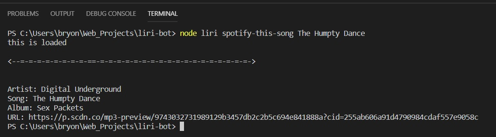
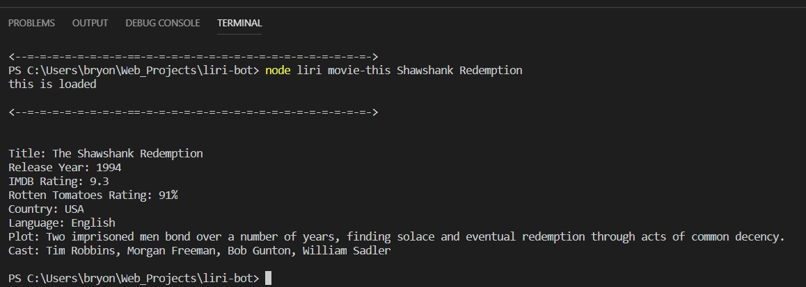

# Liri-bot

This Application uses Node.js to take in responses from a few APIs and display the result in the terminal.  This Application will also output these same results to a text file.

### How Liri-bot works
Liri-bot takes in a command and a search term and returns either details about a movie or a song, depending on the command entered.  Liri then tracks the commands entered and the results returned in the log.txt file.

### Instructions for using Liri-bot
You can enter the following commands to have results returned to you.
* Search for a song
    * Type "node liri spotify-this-song (title of a song)" to find information about that song, like who sang it or which album it was released on
    
    
* Search for a movie
    * Type "node liri movie-this (title of a movie)" to find information about that movie, like the cast, ratings or year it was released
    * If you are unsure of a movie, you can type "node liri movie-this" and a great movie will be shown to you
    
    
* Option 3
    * Type "node liri do-what-it-says" and it returns what has been entered into the file random.txt

### Technologies used
* Javascript
* Node.js
* Axios
* OMDB API
* Spotify API
* Node-Spotify-API
* fs
* dotenv
